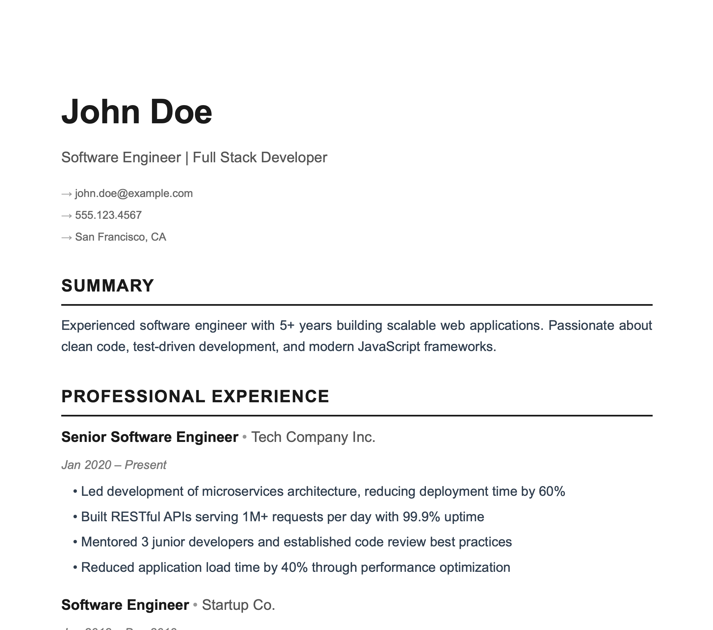
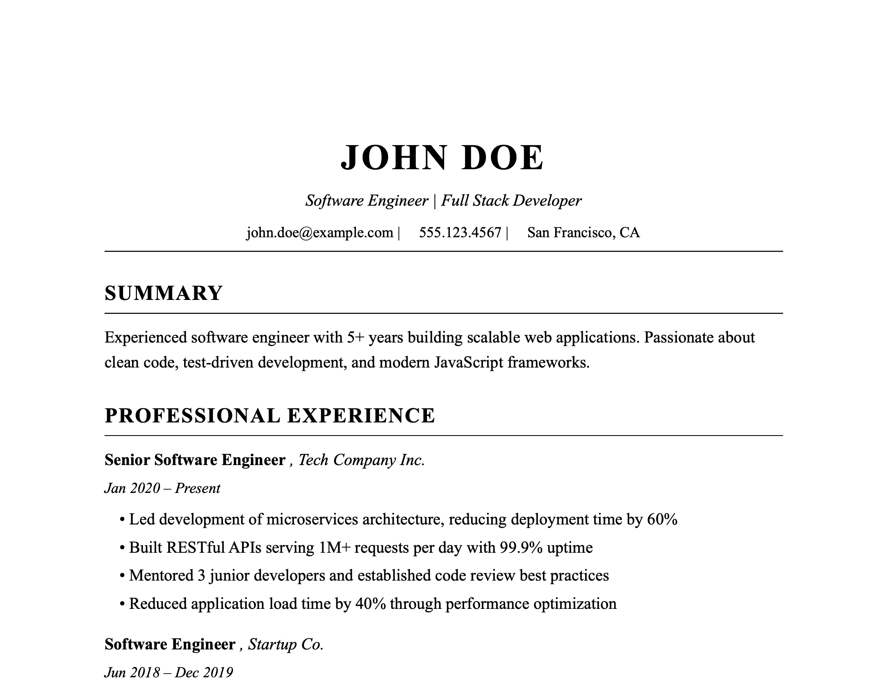
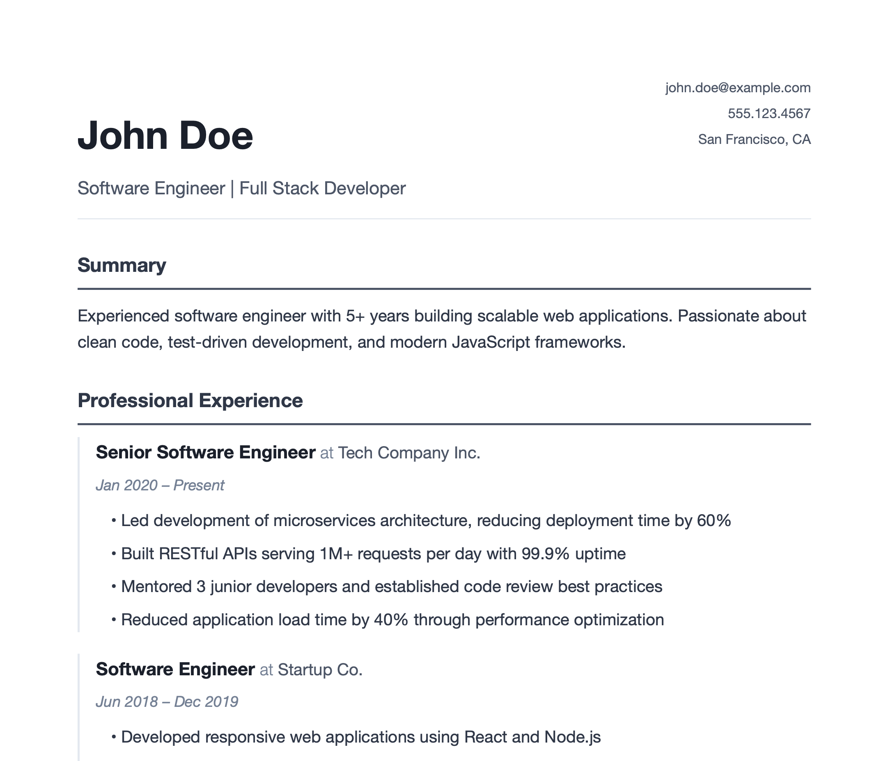

# Resume Builder

A flexible, command-line resume builder that generates professional HTML and PDF resumes from YAML data files. Perfect for quickly customizing content, style, and layout for different job applications.

## Features

- 📝 **YAML-based resume data** - Store resume content in simple YAML files
- 🎨 **Jinja2 templating** - Customize HTML templates for different styles
- 📄 **PDF generation** - Export to PDF using WeasyPrint (PDF/A compliant)
- ✅ **ATS compliance checking** - Built-in ATS compliance validation
- 📁 **Organized outputs** - Automatically organizes outputs into subfolders
- 🎯 **Multiple resume versions** - Easily maintain different resume versions (e.g., Director-SaaS, Engineer-Fintech, Manager-Healthcare)

## Quick Start

### Prerequisites

- Python 3.9+
- pip

### Installation

1. Clone the repository:
```bash
git clone https://github.com/rivetgeek/resume-builder.git
cd resume-builder
```

2. Create a virtual environment:
```bash
python3 -m venv venv
source venv/bin/activate  # On Windows: venv\Scripts\activate
```

3. Install dependencies:
```bash
pip install -r requirements.txt
```

4. Install WeasyPrint system dependencies (for PDF generation):

**macOS:**
```bash
brew install pango gdk-pixbuf libffi
```

**Ubuntu/Debian:**
```bash
sudo apt-get install python3-cffi python3-brotli libpango-1.0-0 libpangoft2-1.0-0
```

**Windows:**
WeasyPrint should work out of the box, but you may need GTK+ runtime libraries.

### Usage

1. Create your resume data file in the `data/` or `data/personal/` directory (see `data/resume-example.yml` for a template)
   - Files in `data/personal/` are gitignored and won't be committed to version control

2. Run the script:
```bash
python3 resume_builder.py
```

3. Select a template from the list:
   - **Modern Minimal** - Clean, simple design with sans-serif fonts
   - **Classic Professional** - Traditional layout with serif fonts
   - **Contemporary** - Modern design with subtle colors

4. Select your resume YAML file from the list

5. The script will:
   - Generate HTML and PDF files
   - Save them to `outputs/{suffix}/` (e.g., `outputs/Director-SaaS/` for `resume-Director-SaaS.yml`)
   - Optionally run ATS compliance checks

### Command Line Options

```bash
python3 resume_builder.py [OPTIONS]

Options:
  --pdf              Generate a PDF using WeasyPrint
  --no-ats-check     Skip ATS compliance validation
  --pdf-variant      PDF variant to generate (pdf/a-1b, pdf/a-2b, pdf/a-3b, pdf/a-4b)
                     Default: pdf/a-2b

# Default behavior (no flags): Generates PDF and skips ATS check
python3 resume_builder.py
```

## Resume Data Format

Create a YAML file in the `data/` directory with your resume information:

```yaml
name: Your Name
title: Your Job Title
contact:
  location: City, State
  mobile: 123.456.7890
  email: your.email@example.com
summary: >
  Your professional summary here.

experience:
  - title: Job Title
    company: Company Name
    dates: Jan 2020 – Present
    bullets:
      - Accomplishment with quantified results
      - Another achievement with metrics

General_Technologies:
  - Technology 1
  - Technology 2

Security_Disciplines:
  - Discipline 1
  - Discipline 2

Languages:
  - Language 1
  - Language 2

Security_Tools:
  - Tool 1
  - Tool 2
```

See `data/resume-example.yml` for a complete example.

## Output Organization

Outputs are organized by resume filename suffix (e.g., `resume-Director-SaaS.yml` → `outputs/Director-SaaS/`). Each folder contains `{First}_{Last}_Resume.html`, `{First}_{Last}_Resume.pdf`, and optionally `{First}_{Last}_Resume_ats_report.txt`.

## ATS Compliance

The built-in ATS compliance checker validates required sections, action verbs, quantifiable metrics, keyword coverage, HTML structure, and ATS-friendly fonts. Use `--pdf` to enable or `--no-ats-check` to skip.

## Templates

The project includes three generic templates, each with a distinct style:

### Modern Minimal
- **File**: `modern-minimal.html.j2`
- **Style**: Clean, simple design with Arial/Helvetica fonts, minimal styling
- **Best for**: Tech roles, modern industries, minimalist aesthetic



### Classic Professional
- **File**: `classic-professional.html.j2`
- **Style**: Traditional layout with Times New Roman, centered header, conservative styling
- **Best for**: Traditional industries, finance, law, academia



### Contemporary
- **File**: `contemporary.html.j2`
- **Style**: Modern design with system fonts, subtle colors, and balanced layout
- **Best for**: Creative roles, marketing, design, modern corporate



## Customization

### Creating Custom Templates

You can create your own templates by adding `.html.j2` files to `templates/html/`. Personal templates can be placed in `templates/html/personal/` (gitignored).

All templates use the same YAML data structure and support all sections (summary, experience, technologies, etc.).

### Fonts

Templates use system fonts by default. To use custom fonts, add font files to `fonts/` and update `@font-face` declarations in your template.

### PDF Variants

Choose PDF/A variants for archival compliance:
- `pdf/a-1b` - Basic archival
- `pdf/a-2b` - Enhanced archival (default)
- `pdf/a-3b` - Advanced archival
- `pdf/a-4b` - Latest archival standard

## Testing

The project includes a comprehensive test suite using pytest. Run all tests:

```bash
pytest tests/ -v
```

The test suite covers core functionality, ATS compliance checking, security (XSS protection, path traversal prevention), and edge cases.

## Security

- **XSS Protection** - Auto-escaping enabled for all template variables, safe YAML loading
- **Path Traversal Prevention** - Filename validation restricts output paths to safe characters
- **Input Validation** - Required field checks and type safety throughout

## Contributing

Contributions are welcome! Please feel free to submit a Pull Request.

## License

MIT License - see LICENSE file for details

## Troubleshooting

**WeasyPrint fails**: Install system dependencies (see Installation section above).

**Font issues**: Ensure font files are in `fonts/` and template paths are correct.

**YAML errors**: Check indentation, colons after keys, and quote special characters.
